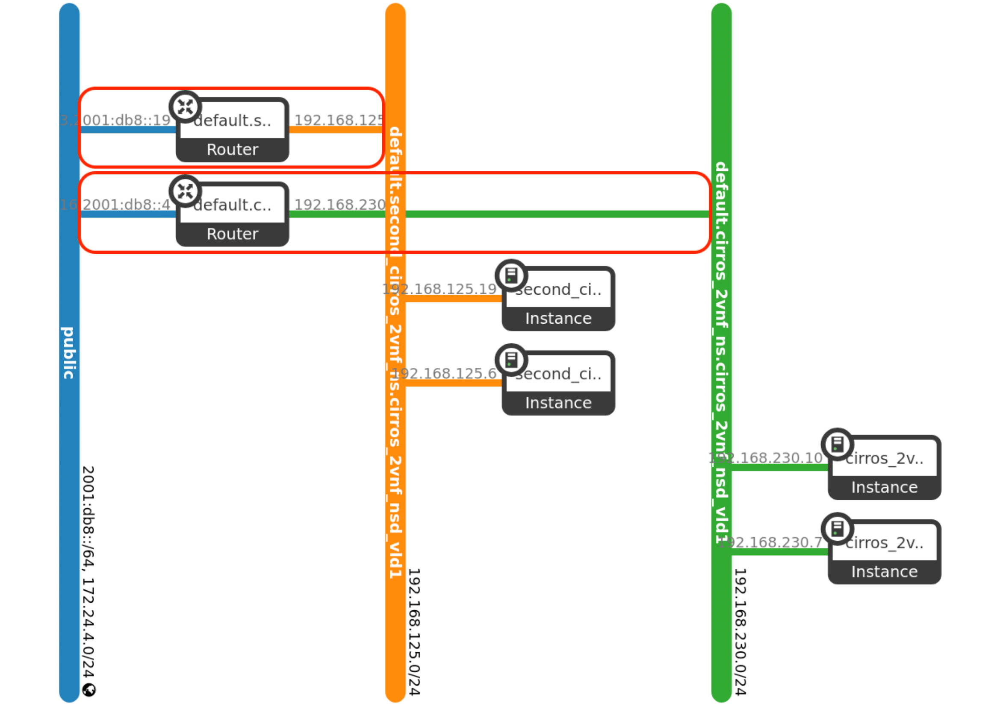
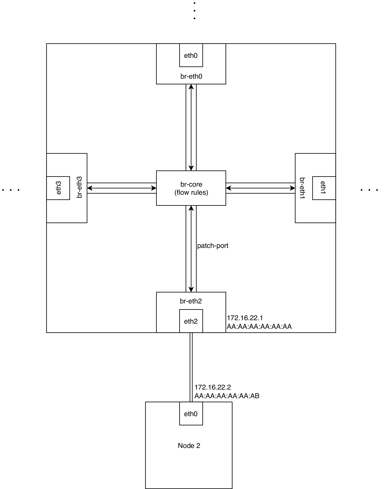

# Testbed Documentation

## Install DevStack

### Requirements

* Ubuntu 16.04
* A single network interface with an IP address already assigned
* At least 2 cores (or more, depending on number of VMs)
* 8 GB RAM (or more, depending on number of VMs)
* 40 GB Disk

### Description
* Uses an newly created user ``stack``
* The dashboard (Horizon) can be accessed under ``http://<IP>/dashboard``
* Login: ``admin`` or ``secret``
* DevStack password is ``secret``

### Step 1: Prerequisites

Install prerequisites and create user ``stack``

```console
$ sudo apt-get update
$ sudo apt-get install -y git

$ sudo useradd -s /bin/bash -d /opt/stack -m stack
$ echo "stack ALL=(ALL) NOPASSWD: ALL" \
    | sudo tee /etc/sudoers.d/stack
```

Switch to user ``stack`` and checkout ``ocata`` branch

```console
$ sudo su - stack
$ git clone https://git.openstack.org/openstack-dev/devstack
$ cd devstack
$ git checkout stable/ocata
```
 
\pagebreak

### Step 2: Install DevStack

Adapt ``HOST_IP`` to match the IP address of the network interface that should be used!

```
$ HOST_IP=10.0.0.110

$ printf "[[local|localrc]]
ADMIN_PASSWORD=secret
DATABASE_PASSWORD=\$ADMIN_PASSWORD
RABBIT_PASSWORD=\$ADMIN_PASSWORD
SERVICE_PASSWORD=\$ADMIN_PASSWORD
HOST_IP=$HOST_IP

REQUIREMENTS_BRANCH=stable/ocata
HORIZON_BRANCH=stable/ocata
KEYSTONE_BRANCH=stable/ocata
NOVA_BRANCH=stable/ocata
NEUTRON_BRANCH=stable/ocata
GLANCE_BRANCH=stable/ocata
CINDER_BRANCH=stable/ocata
IRONIC_BRANCH=stable/ocata
SWIFT_BRANCH=stable/ocata

RECLONE=yes
" | tee local.conf

$ # This can take 20+ minutes
$ ./stack.sh
```

\pagebreak

Alternatively, to use the ``PROVIDER``-network option where guests are spawned in the same network as the Devstack-controller (DHCP required, adapt ``NETWORK_GATEWAY`` and ``IPV4_ADDRS_SAFE_TO_USE`` accordingly):

```
$ HOST_IP=131.234.250.212

$ printf "[[local|localrc]]
HOST_IP=$HOST_IP
SERVICE_HOST=$HOST_IP
MYSQL_HOST=$HOST_IP
RABBIT_HOST=$HOST_IP
GLANCE_HOSTPORT=$HOST_IP:9292
PUBLIC_INTERFACE=eno1

ADMIN_PASSWORD=secret
MYSQL_PASSWORD=secret
RABBIT_PASSWORD=secret
SERVICE_PASSWORD=secret

## Neutron options
Q_USE_SECGROUP=True
ENABLE_PROJECT_VLANS=True
PROJECT_VLAN_RANGE=3001:4000
PHYSICAL_NETWORK=default
OVS_PHYSICAL_BRIDGE=br-ex

Q_USE_PROVIDER_NETWORKING=True

disable_service q-l3

## Neutron Networking options used to create Neutron Subnets

IPV4_ADDRS_SAFE_TO_USE="203.0.113.0/24"
NETWORK_GATEWAY=203.0.113.1
PROVIDER_SUBNET_NAME="provider_net"
PROVIDER_NETWORK_TYPE="vlan"
SEGMENTATION_ID=2010
USE_SUBNETPOOL=False
" | tee local.conf
```


 \pagebreak

### Step 3: Configure guest VM connectivity

At this point DevStack is running but connectivity of guest VMs is limited (No internet access, hence no downloading of software to run on guest VMs; one cannot ssh into guest VMs).
To enable internet access from guest VMs an iptables rule needs to be added.

Modify ``eth0`` to match the interface name with the IP address configured above (``HOST_IP``).

```console
$ sudo iptables -t nat -A POSTROUTING -o eth0 -j MASQUERADE
```

To be able to ssh into guest VMs security group rules of OpenStack need to be modified.

```console
$ source devstack/accrc/admin/admin

$ openstack security group rule create --proto icmp --dst-port 0 default
$ openstack security group rule create --proto tcp --dst-port 22 default
$ nova secgroup-add-rule default icmp -1 -1 0.0.0.0/0
$ nova secgroup-add-rule default tcp 22 22 0.0.0.0/0
```


### Usage hints

#### User credentials

As user ``stack`` one has to ``source`` the admin credentials located in ``/opt/stack/devstack/accrc/admin/admin`` before being able to issue commands starting with ``openstack``, like ``openstack network list`` (There is also a ``demo`` account that is created automatically in ``/opt/stack/devstack/accrc/demo/demo`` which has less privileges).

Example:

```console
$ source /opt/stack/devstack/accrc/admin/admin
$ openstack project list
$ openstack network list
```

#### Reboot

After a reboot of the machine DevStack will not run anymore.
Login as user ``stack`` an re-run

```console
$ /opt/stack/devstack/stack.sh
```


## Install Kubernetes

### Requirements

* Ubuntu 16.04
* A single network interface with internet connectivity
* At least 2 cores (or more, depending on number of Containers)
* 2 GB RAM (or more, depending on number of Containers)
* 20 GB Disk


### Step 1: Prerequisites

Run as ``root``

```console
# apt-get update
# apt-get install -y docker.io
# apt-get update && apt-get install -y apt-transport-https curl
# curl -s https://packages.cloud.google.com/apt/doc/apt-key.gpg | apt-key add -
# cat <<EOF >/etc/apt/sources.list.d/kubernetes.list
deb https://apt.kubernetes.io/ kubernetes-xenial main
EOF
# apt-get update
# apt-get install -y kubelet kubeadm kubectl
# apt-mark hold kubelet kubeadm kubectl
```

### Step 2: Install Kubernetes

```console
# swapoff -a
# # This can take 10+ minutes
# kubeadm init --apiserver-bind-port 443
```


To allow running ``kubectl`` as non-``root`` user switch to that user and run:

```console
$ mkdir -p $HOME/.kube
$ sudo cp -i /etc/kubernetes/admin.conf $HOME/.kube/config
$ sudo chown $(id -u):$(id -g) $HOME/.kube/config
```

### Step 3: Install and configure networking

Install Pod Network Add-On ``Weave Net``:

```console
# sysctl net.bridge.bridge-nf-call-iptables=1
# kubectl apply -f "https://cloud.weave.works/k8s/net?\
k8s-version=$(kubectl version | base64 | tr -d '\n')"
```


``MetalLB`` exposes Pods to the outside world (e.g., reachability from other VMs in the chain) by assigning an IP address to each ``Service`` with ``type = 'LoadBalancer'``.

Install ``MetalLB``:

```console
$ kubectl apply -f https://raw.githubusercontent.com/\
google/metallb/v0.7.3/manifests/metallb.yaml
```

``MetalLB`` needs additional information, like which pool of IP addresses to use and assign to ``Services``.
These settings are provided by applying ``metallb-config.yaml``:

```console
$ kubectl apply -f metallb-config.yaml
```

If multiple Kubernetes clusters are used then each cluster should use a different pool of IP addresses to avoid overlapping.
In ``metallb-config.yaml`` adapt this part accordingly:

```
...
addresses:
  - 10.0.0.80-10.0.0.99
...
```

#### Why ``MetalLB`` and ``Weave Net``

``MetalLB`` is currently the only solutions that provides support for load balancers running on bare metal clusters.

``Weave Net`` is one of the few Kubernetes Network Add-Ons that is [**supported**](https://metallb.universe.tf/installation/network-addons/) by ``MetalLB`` .
[**Compared to other options**](https://chrislovecnm.com/kubernetes/cni/choosing-a-cni-provider/) it provides a rich feature set.


### Step 4: Allow spawning of Pods on master node

To enable spawning Pods on (this) master node:

```console
$ kubectl taint nodes --all node-role.kubernetes.io/master-
```

### Step 5: Using the Kubernetes Python API

The Kubernetes Python API requires specifically version ``0.32.0`` of the ``websocket-client``.
Python 3 additionally requires the package ``certifi``.

That means for Python 2:

```console
$ sudo pip uninstall websocket-client
$ sudo pip install -Iv websocket-client==0.32.0
```

That means for Python 3:

```console
$ sudo pip3 uninstall websocket-client
$ sudo pip3 install -Iv websocket-client==0.32.0
$ pip3 install certifi
```

Add ``clusterrolebinding`` to allow the ``serviceaccount`` used by the Python API to access the API.
Other options for ``clusterrole`` are ``clusterrole=view`` or ``clusterrole=cluster-admin``

```console
$ kubectl create clusterrolebinding default-edit \
    --clusterrole=edit \
    --serviceaccount=default:default \
    --namespace=default
```


An example with the minimal required code can be found in ``k8s-api-example.py``.

The official documentation for the Python API calls provides a page for [**Core**](https://github.com/kubernetes-client/python/blob/master/kubernetes/docs/CoreV1Api.md) functions and [**Extended**](https://github.com/kubernetes-client/python/blob/master/kubernetes/docs/ExtensionsV1beta1Api.md) functions.
These two sources provide all information needed to work with the Python API.

### Step 6: Enable Docker remote API

By default the docker API can only be accessed from ``localhost``.
``vimconn_kubernetes.py`` uses the docker API running on an Kubernetes node to request available images etc.

To allow remote access to the Docker API login as ``root`` and run:

```console
# mkdir -p /etc/systemd/system/docker.service.d/
# touch /etc/systemd/system/docker.service.d/startup_options.conf
# printf "# /etc/systemd/system/docker.service.d/override.conf
[Service]
ExecStart=
ExecStart=/usr/bin/dockerd -H fd:// -H tcp://0.0.0.0:2376
" | tee /etc/systemd/system/docker.service.d/startup_options.conf

# systemctl daemon-reload
# systemctl restart docker.service
```

## Install OSM

### Requirements

* Ubuntu 16.04
* A single network interface with internet connectivity
* At least 4 cores
* 2 GB RAM (or more, depending on number of Containers)
* 40 GB Disk

### Step 1: Install prerequisites

Configure LXD because OSM deploys each component (Resource Orcheststrator, Service Orcheststrator, ...) in a separate LXD container.

```console
$ sudo apt-get update
$ sudo apt-get install -y lxd
```

```console
$ newgrp lxd
$ sudo lxd init
```

Press ``ENTER`` until IPv6 settings pop up then select ``NO``.

```console
$ lxc list
$ ip address show ens3 # In case ens3 is the default interface
$ ip address show lxdbr0
$ sudo lxc profile device set default eth0 mtu 1500
$ exit
```

### Step 2: Install osmclient

Install osmclient to allow subsequent invocation of commands, like ``osm vim-create ...``.

```console
$ sudo apt-get update
$ sudo apt-get install -y software-properties-common \
    python-pip curl git
$ pip install python-magic
$ curl http://osm-download.etsi.org/repository/osm/\
    debian/ReleaseTHREE/OSM%20ETSI%20Release%20Key.gpg \
    | sudo apt-key add -
$ sudo add-apt-repository -y "deb [arch=amd64] \
    http://osm-download.etsi.org/repository/osm/debian/\
    ReleaseTHREE stable osmclient"
$ sudo apt-get update
$ sudo apt-get install -y python-osmclient
```

### Step 3: Install OSM RO, SO & VCA

```console
$ # This can take 20+ minutes
$ ./install_osm.sh --lxdimages
```

### Step 4: Configure osmclient and install vimconn-Plugins

Run

```console
$ ./install_vimconn_plugins.sh
```

to automatically configure environment variables needed for osmclient and install the Kubernetes vimconn-Plugin and an updated version of the OpenStack vimconn-Plugin.
The difference between the old and the updated version of the OpenStack vimconn-Plugin is the connectivity of VMs.
The old version

* Creates a tennant network for each network-service deployed with OSM (tennant separation
    - VMs are completely isolated from everything else than other guest VMs in the **same** tennant network
    - No connectivity to Kubernetes Pods or the internet

The new version

* Creates a tennant network for each network-service deployed with OSM (tennant separation)
* Creates a router that connects the tennant network and the public network
* Connects the router accordingly and sets it as gateway (**internet access for guest VMs**)



## Install Open vSwitch-Router

### Requirements

* Ubuntu 16.04
* A single network interface with internet connectivity
* One network interface per router port
* Open vSwitch ``>=2.5.4``

Install Open vSwitch:

```console
$ sudo apt-get update && \
    sudo apt-get install -y openvswitch-switch
```

### Setup

* The switch acts as a router as each port is connected to a different subnet
* Each NIC is connected to one node
* All flow rules are maintained in ``br-core``
* There is one OVS bridge connected to each NIC (e.g., ``eth0`` is connected to ``br-eth0``)
* Each NIC bridge (e.g., br-eth0) is connected to ``br-core`` via a patch port
* Each NIC bridge forwards all traffic from one side to the other (e.g., ``eth0`` &rarr; ``br-eth0`` &rarr; ``br-core``). There is no additional forwarding/routing logic as this in ``br-core``.

To setup this architecture login as ``root`` and modify these lines in ``ovs-setup.sh``:

```
...
gatewaynic=ens160
nic=(ens192 ens224 ens256)
ip=(172.16.21 172.16.22 172.16.23)
subnet=172.16.0.0/16
...
```

where ``gatewaynic`` is the NIC that is used as gateway for all connected nodes and the router itself. ``ovs-setup.sh`` uses DHCP to obtain an IP address for ``gatewaynic``.

``nic`` and ``ip`` are arrays which contain names of NICs and corresponding IP addresses without the last dot and digit (e.g., ``.192.168.2.1`` becomes ``192.168.2``) in the same order. That means ``ens192`` belongs to ``172.16.21`` and so on.

``subnet`` needs to be set to the subnet that all subnets for all ports are located in (e.g., ``172.16.0.0/16`` if there are router ports ``172.16.21.1``, ``172.16.22.1``, ``172.16.23.1``)

``ovs-setup.sh`` assigns IP addresses defined in ``ip`` ending in ``.1`` for all router ports in ``nic``.

``ovs-setup.sh``

* enables IPv4 forwarding in the kernel such that packet that should be forwarded will not be discarded
* install a corresponding ``iptables`` rules
* adds all OVS-bridges and OVS-patch-ports
* assigns IP addresses to each router port (except ``gatewaynic``)

Login as ``root`` and run:

```console
# ./ovs-setup.sh
```




## Setup SDN Controller

### Requirements

* Ubuntu 16.04
* A network connection which can be reached from the OVS router
* 1 core (or more, depends on traffic)
* 1 GB RAM
* 10 GB Disk

### Install Ryu

```console
$ sudo apt-get update
$ sudo apt-get install python-pip
$ pip install ryu
```

### Start Ryu

To start the Ryu controller run

```console
$ ryu-manager controller.py
```

Running Ryu blocks the terminal until it is terminated (``CTRL + C``).
To avoid this one can use ``nohup``, ``screen`` or ``tmux`` to run it in background.

### Connect OVS router to OpenFlow Controller

To connect the OVS router to the SDN controller the controller entry needs to be set. Run as ``root`` on the OVS router

```console
# controller_ip=tcp:131.234.29.73
# ovs-vsctl set-controller br-core tcp:controller_ip:6633
```

Additionally, the OVS router needs one default flow rule (``priority=0`` ) which makes it send all packets to the controller.
The controller then adds all further flow rules with higher priorities.
If an incoming packet does not match any of the rules added by the controller then it gets send to the controller.

```console
# ovs-ofctl del-flows -OOpenflow13 br-core
# ovs-ofctl add-flow -OOpenFlow13 br-core "table=0, priority=0,\
    actions=CONTROLLER:65535"
```


## Using OSM

### Creating a Network Service

Descriptors can be created using an official one as a base.
For each Network Service Descriptor (NSD) there needs one VNFD for each VNFD references in the NSD.
That means you need at least one VNFD for each NSD.
Descriptors need to be uploaded to OSM before they can be deployed.
Descriptors are uploaded as zip-compressed tarball packages(_.tar.gz_).
To create both descriptors it is easiest to modify the [**official example**](https://osm-download.etsi.org/ftp/osm-3.0-three/examples/cirros_2vnf_ns/).

Unpack package:

```console
$ tar xvf descriptor.tar.gz
```

Within each package (NSD and VNFD) there is a _.yaml_-file which is the actual descriptor.

After modifiying the _.yaml_-file one needs to update the MD5 checksum in ``checksums.txt``. To obtain the checksum run

```console
$ md5sum cirros_vnfd.yaml
```

Create a package from a folder:

```console
$ tar cvf descriptor.tar.gz descriptor
```

Before uploading a NSD to OSM one has to upload all VNFD references in the NSD.
Upload a package to OSM to be able to deploy it:

```conosle
$ osm upload-package descriptor.tar.gz
```

### Before deploying a NS on OpenStack

To be able to deploy a NS on OpenStack the name of the image that is used in the VNFD must exactly match the name of an available image in OpenStack (using spaces in image names does not work).
Using an image named ``cirros034`` as in the following VNFD snippet requires a pre-upload VM iamge to OpenStack.

```
...
vdu:
-   id: cirros_vnfd-VM
    name: cirros_vnfd-VM
    description: cirros_vnfd-VM
    count: 1

    # Flavour of the VM to be instantiated for the VDU
    # flavor below can fit into m1.micro
    vm-flavor:
        vcpu-count: 1
        memory-mb: 256
        storage-gb: 2

    # Image/checksum or image including the full path
    image: cirros034
...
```

Login as user ``stack``, get/download the image, source the DevStack credentials and run the ``openstack image create``-command:

```console
$ source devstack/accrc/admin/admin
$ wget http://download.cirros-cloud.net/0.3.4/cirros-0.3.4-x86_64-disk.img
$ openstack image create --file="./cirros-0.3.4-x86_64-disk.img" \
    --container-format=bare --disk-format=qcow2 cirros034
```

### Adding a VIM to OSM

Use the osmclient to add a VIM to OSM.
For each VIM one needs to pass the following parameters

* ``name`` -- Name of the VIM that is later used to deploy Network Services.
* ``user`` -- Username that OSM uses to access the API of the VIM
* ``password`` -- Password that OSM uses to access the API of the VIM
* ``auth_url`` -- URL that OSM uses to access the API of the VIM
* ``tenant`` -- Used tennant (e.g., _project_ in OpenStack)
* ``config`` -- Add multiple custom options. Each VIM-connector plugin uses these options differently.
* ``account_type`` -- VIM-type (e.g., _openstack_ or _kubernetes_)

#### Example: Add two OpenStack VIMs

```console
$ osm vim-create --name openstack-1 --user admin\
    --password secret --auth_url http://131.234.29.63:5000/v2.0\
    --tenant admin --config '{public_network:\
    d84d641d-c832-4e94-bb07-ef607710e132, use_floating_ip: True}'\
    --account_type openstack

$ osm vim-create --name openstack-2 --user admin\
    --password secret --auth_url http://131.234.29.65:5000/v2.0\
    --tenant admin --config '{public_network:\
    35cd1896-702e-4aba-b693-5bc27eb88e90, use_floating_ip: True}'\
    --account_type openstack
```

#### Example: Add two Kubernetes VIMs

Kubernetes requires a ``token`` but no ``user`` and ``password``.
Since ``user`` and ``password`` are required one can put everything there -- it is not used by the VIM-connector plugin.
The ``token`` cannot be placed into the ``password``-field because it is too long.
The Kubernetes VIM-connector plugin uses the ``config``-field to reference a file that contains a token.
Beside the token it also requires a ``ca_cert`` to reference the certificate file in ``config``.

```console
$ osm vim-create --name kubernetes-1 --auth_url\
    https://131.234.29.67:6443 --tenant 'default'\
    --user 'dummy' --password 'dummy'\
    --config '{"ca_cert": "/root/ca1.crt", "token":\
    "/root/token1"}' --account_type kubernetes

$ osm vim-create --name kubernetes-2 --auth_url\
    https://131.234.29.69:6443 --tenant 'default'\
    --user 'dummy' --password 'dummy'\
    --config '{"ca_cert": "/root/ca2.crt", "token":\
    "/root/token2"}' --account_type kubernetes
```

### Deploying a Network Service

```console
$ osm ns-create --nsd_name my_service --ns_name <name of NSD>\
    --vim_account kubernetes-1
```

\pagebreak

## Testbed Specific

### Credentials

On each VM

* Login: ``user``
* Password: ``resu``

On DevStack there is an additional user ``stack``.
To login as ``stack`` or ``root`` first login as ``user`` and run:

```console
$ sudo su - stack
```

or

```console
$ sudo su - root
```

No password needed.

To enable ``root`` access without password run

```console
$ sudo visudo
```

and change

```
%sudo   ALL=(ALL:ALL) ALL
```

to 

```
%sudo   ALL=(ALL:ALL) NOPASSWD:ALL
```

### SSH into Machines

To SSH into one of the machine, first SSH into the router.
The ``hosts`` file is setup such that one can easily access all other machine by running **from the router**

```console
$ ssh vm1
```

to access VM 1.

All machines can be accessed with the (private) SSH key from the router.
That means, you can obtain easy access to the entire testbed by just putting your own (public) SSH key on the router (using ``ssh-copy-id``).

### Distribution of Function on VMs

* VM 1 -- DevStack #1
* VM 2 -- DevStack #2
* VM 3 -- Kubernetes #1
* VM 4 -- Kubernetes #2
* VM 5 -- OSM
* VM 6 -- SDN controller
* VM 7 -- OVS router

### VLAN Setup

|    **VM**    |  **Network**   | **NIC on router** |
| ------------ | -------------- | ----------------- |
| vm-millian01 | 172.16.21.0/24 |      ens192       |
| vm-millian02 | 172.16.22.0/24 |      ens224       |
| vm-millian03 | 172.16.23.0/24 |      ens256       |
| vm-millian04 | 172.16.24.0/24 |      ens161       |
| vm-millian05 | 172.16.25.0/24 |      ens193       |
| vm-millian06 | 172.16.26.0/24 |      ens225       |
| vm-millian08 | 172.16.27.0/24 |      ens257       |
| vm-millian09 | 172.16.28.0/24 |      ens162       |

### Routing Tables

All machines connected to the OVS router have the port connected to the router set as their gateway
